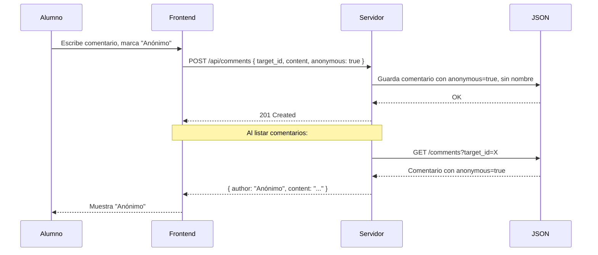

# 📘 Plataforma Educativa con Rangos, Clases, Tareas y Comentarios Anónimos

## 1. Descripción General

Sistema web que permite la gestión de clases, roles de **profesor** y **alumno**, publicación de tareas y contenido, comentarios anónimos opcionales, calificaciones, notificaciones y archivado de clases.  
Todos los datos se almacenan en archivos **JSON** dentro del propio servidor (sin base de datos externa).

---

## 2. Roles y Permisos (Rangos)

| Función                          | Profesor | Alumno |
|----------------------------------|----------|--------|
| Crear / archivar clases          | ✅       | ❌     |
| Añadir tareas y contenido        | ✅       | ❌     |
| Calificar tareas                 | ✅       | ❌     |
| Bloquear entrega de tareas (hora/día) | ✅  | ❌     |
| Publicar anuncios en el tablón   | ✅       | ✅     |
| Comentar en publicaciones del profesor | ✅ (como alumno) | ✅ (con opción anónimo) |
| Ver su calificación total (promedio) | ✅ (configurable por profesor) | ✅ (solo si el profesor lo permite) |
| Ver notificaciones               | ✅       | ✅     |
| Ver contenido / tareas           | ✅       | ✅     |

> **Nota:** Los comentarios anónimos **nunca** revelan la cuenta del alumno, ni siquiera para el profesor.

---

## 3. Módulos Funcionales

### 3.1 Gestión de Clases

- **Creación de clases**: Solo profesores. Cada clase tiene:
  - ID único
  - Nombre, descripción
  - Fecha de creación
  - Estado: `activa` o `archivada`
- **Archivado**: Las clases no se eliminan, solo se archivan (siguen visibles en un listado aparte).
- **Miembros**: Lista de alumnos (por nombre de usuario) y el profesor propietario.

### 3.2 Publicación de Contenido y Tareas (Profesor)

- El profesor puede añadir:
  - **Contenido educativo** (texto, enlaces, archivos simulados)
  - **Tareas**: título, descripción, fecha límite, opción de bloqueo automático tras X horas/día
- Cada tarea puede ser **calificada** (nota numérica o escala personalizada).
- **Bloqueo de entregas**: El profesor define una fecha/hora límite. Pasado ese momento el sistema impide nuevas entregas.

### 3.3 Comentarios (en Contenido y Tareas)

- **Alumnos** pueden comentar cualquier publicación del profesor.
- **Comentario anónimo** (opción al escribir):
  - Si se activa, el sistema **no almacena ni muestra** el nombre del alumno.
  - Bajo ninguna condición se revela la identidad (ni en notificaciones, ni al profesor, ni en logs internos).
  - Los comentarios normales muestran el nombre del alumno.

### 3.4 Tablón de Anuncios

- **Cualquier miembro** (profesor o alumno) puede publicar anuncios.
- En el tablón **siempre aparece el nombre del autor** (sin opción anónimo).
- El orden es cronológico inverso.

### 3.5 Calificaciones y Promedio Total

- El profesor califica cada tarea de cada alumno.
- Cada alumno tiene un **promedio** = suma de notas de tareas / número de tareas calificadas en esa clase.
- El profesor puede activar/desactivar un interruptor por clase: **“Permitir que los alumnos vean su calificación total”**.
- Alumnos solo ven su promedio si el profesor lo autoriza.

### 3.6 Notificaciones

- **Eventos que generan notificación**:
  - Nueva tarea o contenido publicado (a todos los alumnos de la clase)
  - Comentario nuevo en una publicación (al profesor)
  - Tarea calificada (al alumno correspondiente)
  - Anuncio nuevo (a todos los miembros de la clase)
- **Panel de notificaciones**:
  - Lista con marcador de leído/no leído.
  - Fecha, mensaje, enlace al elemento relevante.
- **Notificaciones del profesor**:
  - Aparece cada vez que califica una tarea (confirmación), además de comentarios y anuncios.

### 3.7 Archivado de Clases

- Las clases archivadas:
  - No aparecen en el panel activo por defecto (pero se pueden consultar).
  - No se pueden modificar tareas ni comentarios.
  - El profesor puede “desarchivar” una clase.

---

## 4. Almacenamiento: Estructura JSON en el Servidor

El sistema guarda todos los datos en archivos `.json` dentro de una carpeta `data/`.  
Se usan **IDs únicos** y referencias entre archivos.

### 4.1 Archivos Principales

| Archivo               | Propósito                                         |
|-----------------------|---------------------------------------------------|
| `users.json`          | Cuentas de profesores y alumnos                  |
| `classes.json`        | Lista de clases (activas y archivadas)           |
| `enrollments.json`    | Relación alumno ↔ clase (con permisos)           |
| `assignments.json`    | Tareas por clase                                 |
| `contents.json`       | Contenido educativo por clase                    |
| `submissions.json`    | Entregas de tareas por alumno                    |
| `grades.json`         | Calificaciones de tareas                         |
| `comments.json`       | Comentarios (anónimos o no) en contenido/tareas  |
| `announcements.json`  | Anuncios del tablón                              |
| `notifications.json`  | Notificaciones generadas                         |
| `class_settings.json` | Configuración por clase (ej: ver promedio total) |

### 4.2 Ejemplo de Esquemas JSON

#### `users.json`
```json
{
  "users": [
    {
      "id": "u1",
      "username": "prof_juan",
      "password": "hash123",
      "role": "profesor",
      "name": "Juan Pérez"
    },
    {
      "id": "u2",
      "username": "alumno_ana",
      "password": "hash456",
      "role": "alumno",
      "name": "Ana Gómez"
    }
  ]
}
```

#### `classes.json`
```json
{
  "classes": [
    {
      "id": "c1",
      "name": "Matemáticas 101",
      "description": "Álgebra básica",
      "owner_id": "u1",
      "created_at": "2025-01-15T10:00:00Z",
      "archived": false
    }
  ]
}
```
#### 'assignments.json'
```json
{
  "assignments": [
    {
      "id": "a1",
      "class_id": "c1",
      "title": "Ejercicios de ecuaciones",
      "description": "Resolver 10 ecuaciones",
      "due_date": "2025-01-22T23:59:59Z",
      "blocked": false,
      "block_after": "2025-01-22T23:59:59Z"
    }
  ]
}
```

#### `comments.json`
```json
{
  "comments": [
    {
      "id": "com1",
      "target_type": "assignment",
      "target_id": "a1",
      "author_id": "u2",
      "anonymous": true,
      "content": "¿Se puede entregar en papel?",
      "created_at": "2025-01-16T14:30:00Z"
    }
  ]
}
```
* **Regla estricta**: Si anonymous: true, el frontend nunca mostrará author_id ni nombre asociado. El servidor nunca expone esa relación en las respuestas.

#### 'grades.json'
```json
{
  "grades": [
    {
      "assignment_id": "a1",
      "student_id": "u2",
      "score": 8.5,
      "graded_at": "2025-01-25T09:15:00Z"
    }
  ]
}
```
#### 'class_settings.json'
```json
{
  "settings": [
    {
      "class_id": "c1",
      "allow_student_view_total_grade": true
    }
  ]
}
```

## 5. Funcionalidades Detalladas (Casos de Uso)

### 5.1 Creación de Clase (Profesor)

1. Profesor autenticado → apartado “Mis clases” → “Nueva clase”.
2. Ingresa nombre y descripción.
3. Sistema genera ID único y guarda en `classes.json` con `archived: false`.
4. Opcional: invitar alumnos (se añaden a `enrollments.json`).

### 5.2 Publicar Tarea y Bloqueo Automático

- Al crear tarea, el profesor define una **fecha/hora límite**.
- El sistema guarda `due_date` y `blocked: false`.
- Pasado ese momento, cualquier intento de entrega es rechazado (el servidor verifica `due_date`).
- Adicionalmente, el profesor puede **bloquear manualmente** antes de la fecha (cambia `blocked: true`).

### 5.3 Comentario Anónimo

- Alumno escribe comentario y marca casilla “Publicar anónimamente”.
- El servidor guarda el comentario con `anonymous: true` y **no almacena** el nombre en el campo visible.
- Para recuperar comentarios de una tarea, el endpoint `/api/comments?target_id=a1` devuelve:
  - Para comentarios anónimos: `{ "author": "Anónimo", "content": "...", "created_at": "..." }`
  - Para comentarios normales: `{ "author": "Ana Gómez", "content": "...", "created_at": "..." }`
- El profesor **nunca** puede ver quién fue el autor anónimo, ni siquiera desde el panel de administración.

### 5.4 Calificación y Notificaciones

1. Profesor accede a una tarea → lista de alumnos que entregaron.
2. Asigna nota → se guarda en `grades.json`.
3. Se crea una notificación en `notifications.json` para el alumno:
   ```json
   {
     "user_id": "u2",
     "class_id": "c1",
     "message": "Tu tarea 'Ejercicios de ecuaciones' ha sido calificada con 8.5",
     "read": false,
     "created_at": "..."
   }
   ```
4. También se genera una notificación para el profesor (confirmación de calificación).

### 5.5 Ver Calificación Total (Promedio)

- El profesor activa `allow_student_view_total_grade = true` en `class_settings.json`.
- El alumno ve en la clase un indicador “Promedio total: X.XX”.
- El cálculo se hace en tiempo real sumando todas las calificaciones del alumno en esa clase y dividiendo por el número de tareas calificadas.

### 5.6 Anuncios en el Tablón

- Cualquier miembro → formulario “Nuevo anuncio”.
- Se guarda en `announcements.json` con `author_id` y `author_name` (desnormalizado para mostrar rápido).
- Aparece inmediatamente en el tablón con el nombre real del autor.

### 5.7 Archivado de Clase

- Profesor → opción “Archivar clase” sobre una clase activa.
- El sistema actualiza `archived: true` en `classes.json`.
- Las tareas, comentarios, etc. quedan de solo lectura.
- Para desarchivar: mismo proceso cambiando a `false`.

---

## 6. APIs del Servidor (Simulación con JSON)

### 6.1 Ejemplo de Endpoints REST

| Método | Endpoint                    | Descripción                                      |
|--------|-----------------------------|--------------------------------------------------|
| POST   | `/api/login`                | Autenticación, devuelve token y rol              |
| GET    | `/api/classes`              | Lista clases según rol (activas o archivadas)    |
| POST   | `/api/classes`              | Crear clase (solo profesor)                      |
| POST   | `/api/classes/:id/archive`  | Archivar clase                                   |
| GET    | `/api/classes/:id/contents` | Obtener contenido y tareas de una clase          |
| POST   | `/api/assignments`          | Crear tarea                                      |
| POST   | `/api/assignments/:id/submit` | Entregar tarea (alumno)                         |
| POST   | `/api/assignments/:id/grade` | Calificar tarea (profesor)                       |
| POST   | `/api/comments`             | Crear comentario (con flag `anonymous`)          |
| GET    | `/api/comments?target=...`  | Listar comentarios (anónimos ocultos)            |
| POST   | `/api/announcements`        | Publicar anuncio                                 |
| GET    | `/api/notifications`        | Obtener notificaciones del usuario               |
| PUT    | `/api/notifications/:id/read` | Marcar como leída                               |
| GET    | `/api/classes/:id/average`  | Obtener promedio del alumno (si está permitido)  |

### 6.2 Lógica de Anonimato en el Servidor

```python
# Pseudocódigo al obtener comentarios
def get_comments(target_id):
    comments = read_json("comments.json")
    result = []
    for c in comments:
        if c["target_id"] == target_id:
            if c["anonymous"]:
                result.append({
                    "author": "Anónimo",
                    "content": c["content"],
                    "created_at": c["created_at"]
                })
            else:
                user = get_user(c["author_id"])
                result.append({
                    "author": user["name"],
                    "content": c["content"],
                    "created_at": c["created_at"]
                })
    return result
```
## 7. Consideraciones de Implementación

### 7.1 Seguridad y Privacidad

- Las contraseñas se guardan hasheadas (por ejemplo, bcrypt).
- Los comentarios anónimos **no guardan dirección IP** ni metadatos identificables.
- El profesor no puede “desanonimizar” comentarios aunque tenga acceso directo a los archivos JSON. En la práctica, si el servidor es controlado por la institución, se debe asegurar que los logs no capturen la identidad. El diseño elimina la asociación en el modelo de datos.

### 7.2 Control de Entregas Fuera de Plazo

- Al recibir una petición de entrega (`/api/assignments/:id/submit`), el servidor:
  1. Obtiene la tarea.
  2. Compara `due_date` con la fecha actual.
  3. Si `due_date` ya pasó o `blocked == true`, responde `403 Forbidden`.

### 7.3 Notificaciones en Tiempo Real (Opcional)

- Aunque los datos son JSON estáticos, se puede implementar **long polling** o **WebSockets** para notificaciones instantáneas.  
- El documento base asume que el frontend consulta periódicamente el endpoint de notificaciones.

---

## 8. Diagrama de Flujo de Comentario Anónimo


## 9. Posibles Mejoras Futuras

- **Sistema de recuperación de contraseña**
- **Adjuntar archivos a tareas y entregas** (simulados con rutas en JSON)
- **Estadísticas de clase** (promedios generales solo para profesor)
- **Exportar calificaciones a CSV**
- **Modo oscuro** y diseño responsive

---

## 10. Conclusión

El sistema propuesto cumple con todos los requisitos:

- ✅ Roles diferenciados (profesor / alumno)
- ✅ Creación y archivado de clases
- ✅ Publicación de tareas y contenido por el profesor
- ✅ Comentarios con modo anónimo **sin revelar identidad**
- ✅ Tablón de anuncios con nombre visible
- ✅ Calificaciones por tarea y promedio total configurable
- ✅ Bloqueo de entregas por fecha/hora
- ✅ Notificaciones para alumnos y profesor
- ✅ Almacenamiento completo en archivos JSON dentro del servidor

El diseño es **completamente funcional** y puede ser implementado con tecnologías web estándar (Node.js + Express, PHP, Python Flask, etc.) y un frontend en HTML/CSS/JS.

---

> 📌 **Nota final:** Este documento sirve como **especificación técnica** y guía de desarrollo. Los nombres de endpoints, estructuras JSON y flujos pueden adaptarse según el stack elegido, pero manteniendo las reglas de negocio aquí definidas.